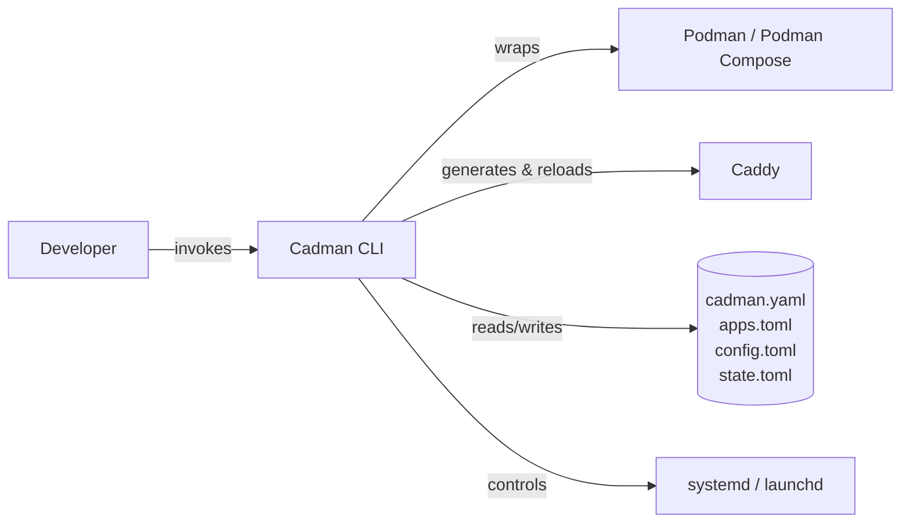

# Cadman Architecture

Welcome to the **Cadman Architecture** documentation.

For developers, contributors, and stakeholders: this section explores the system's design, components, and the decisions that shaped them. It is intended to provide both a conceptual overview and the technical details required for implementation and maintenance.

---

## Purpose

The purpose of this section is to:
- Explain how Cadman is structured and why it’s designed this way.
- Provide developers with the knowledge needed to extend or maintain the system.
- Document key architectural decisions for future reference.

---

## Contents

1. **Executive Summary**  
   A high-level overview of the Cadman system, its goals, and the primary problems it solves.  
   → [Executive Summary](executive-summary.md)

2. **System Context**  
   Describes where Cadman fits within the broader ecosystem, including integrations and external dependencies.  
   → [System Context](system-context.md)

3. **Software Requirements Specification (SRS)**  
   Defines functional and non-functional requirements.  
   → [SRS](srs.md)

4. **High-Level Architecture**  
   Diagrams and descriptions of major components, their responsibilities, and interactions.  
   → [high-level-architecture.md](high-level-architecture.md)

5. **Component & Module Design**  
   In-depth details for each service/module, APIs, data models, and workflows.  
   → [component-design.md](component-design.md)

6. **Data Architecture**  
   Entity-relationship diagrams, storage models, and data flow.  
   → [data-architecture.md](data-architecture.md)

7. **Deployment & Infrastructure**  
   Environments, CI/CD pipelines, infrastructure-as-code overview, and scaling considerations.  
   → [deployment.md](deployment.md)

8. **Security & Compliance**  
   Security model, authentication/authorization flows, and compliance requirements.  
   → [security.md](security.md)

9. **Architectural Decision Records (ADRs)**  
   Log of major decisions, trade-offs, and rejected approaches.  
   → [adr/index.md](adr/index.md)

---

## How to Use This Section

- **New developers** should start with the Executive Summary and System Context.
- **Contributors** should review Component Design and ADRs before making changes.
- **Ops teams** should refer to Deployment & Infrastructure.

